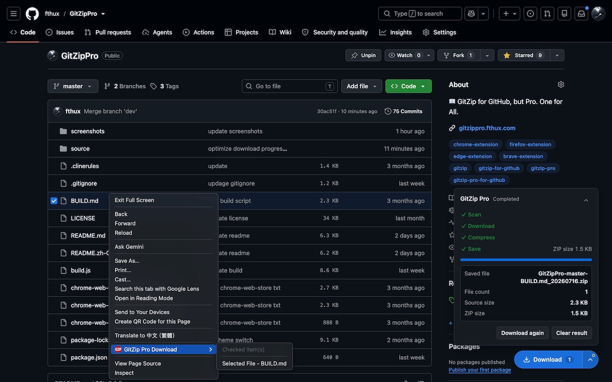
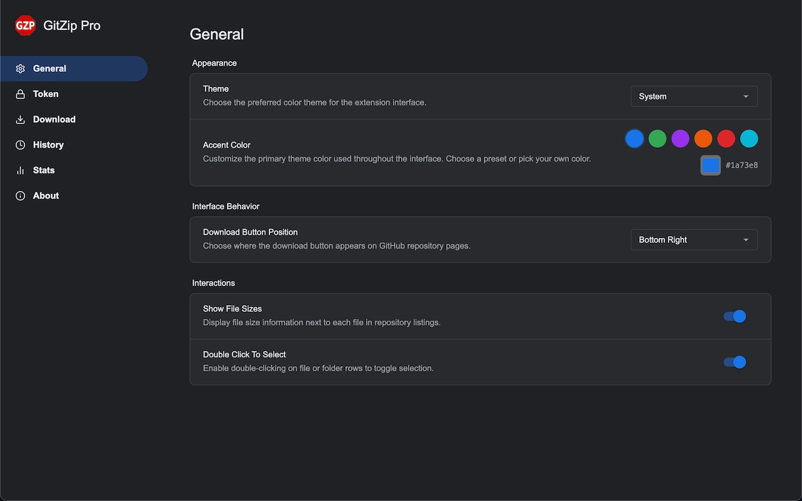
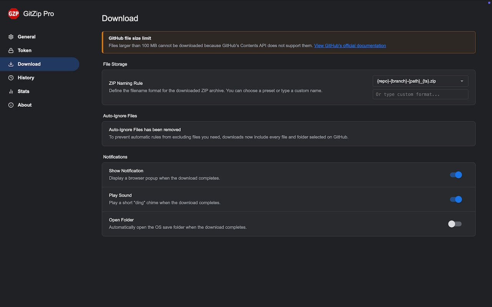
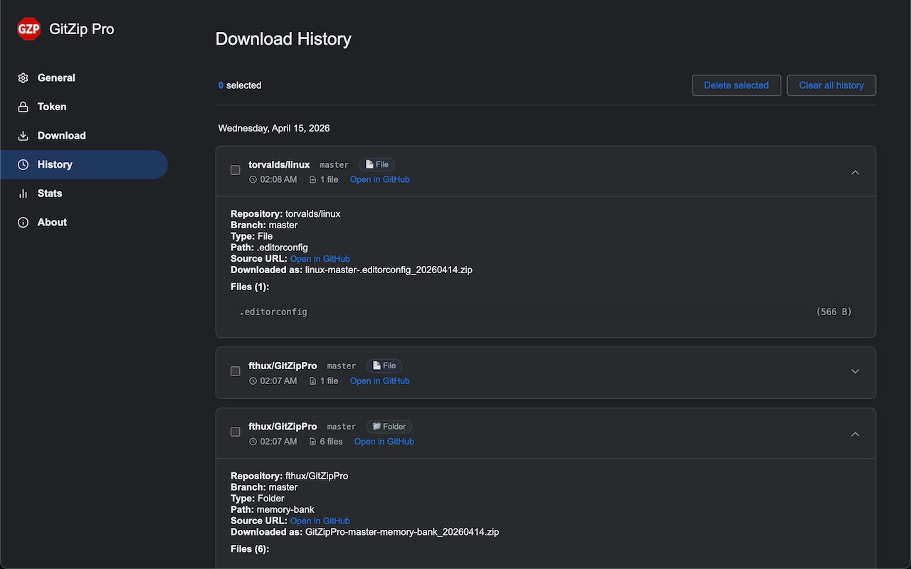
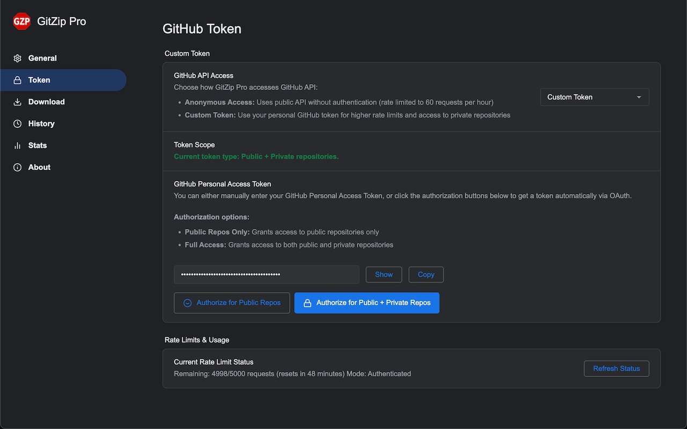
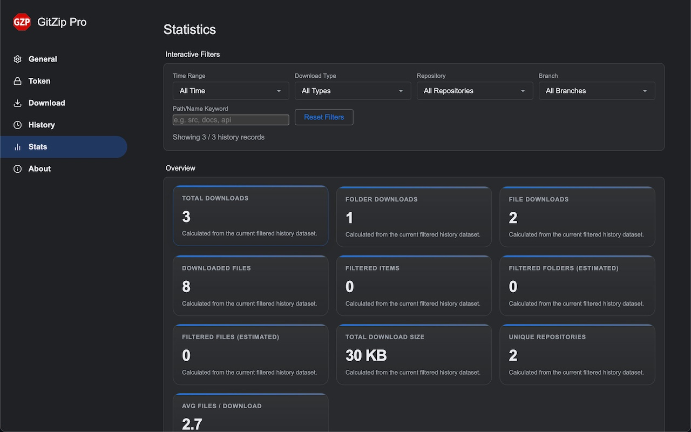
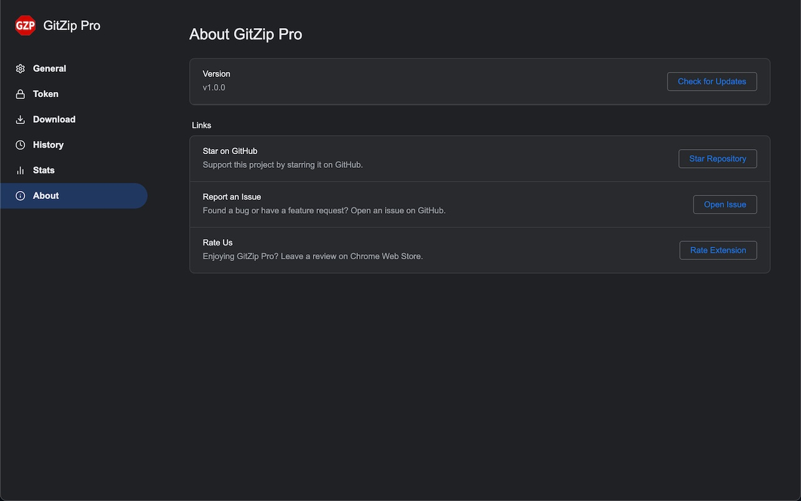

# GitZip Pro

English | [简体中文](./README.zh-CN.md)

GitZip Pro is a Chrome extension inspired by **GitZip for GitHub**, with additional UX and workflow enhancements for downloading selected GitHub files and folders as ZIP archives.

<!--  -->

## Install

- [Chrome Browser](https://chromewebstore.google.com/detail/gitzip-pro/lpjpkopdlnpgcifigibaelbbkmigjjnp)

- [Brave Browser](https://chromewebstore.google.com/detail/gitzip-pro/lpjpkopdlnpgcifigibaelbbkmigjjnp)

- [Edge Browser](https://microsoftedge.microsoft.com/addons/detail/gitzip-pro/nhhmnccepdfgnekfhhchnbagljpifikg)

- [Firefox Browser](https://addons.mozilla.org/en-US/firefox/addon/gitzip-pro)

## Features

### Core Download Experience

- Select files and folders directly on GitHub repository pages with injected checkboxes.
- Download selected items as a ZIP file while preserving directory structure.
- Download a single right-clicked file/folder via Chrome context menu integration.
- Progress-aware floating download button with status states (`idle`, `downloading`, `done`, `error`).
- Automatic SPA navigation handling for GitHub (`turbo`, `pjax`, history navigation, and route changes).

### Smart File Handling

- Recursive folder traversal via GitHub API.
- Parallel download execution with concurrency control.
- Built-in retry logic for rate-limit/network-related GitHub API failures.
- Optional file-size display beside repository file rows.
- Select rows by double-click (configurable).

### Auto-Ignore Rules

- Built-in ignore rule groups for:
  - Git/version-control artifacts
  - System files
  - Dependencies
  - Build outputs
  - Logs/temp files
  - Images
  - Videos
  - Archives
  - Documentation
  - Config files
- Preset ignore combinations: `Full Repository`, `Code Only`, `Documentation Only`, `Design Assets`, `Minimal`.
- Custom wildcard ignore rules (user-defined patterns).
- Download result includes ignored-file statistics in history records.

### Naming, Notifications, and Download Output

- Configurable ZIP naming templates with variables:
  - `{owner}`, `{repo}`, `{branch}`, `{path}`, `{date}`, `{datetime}`, `{ts}`
- Preset naming strategies plus custom naming input.
- Optional completion notification.
- Optional completion sound.
- Optional auto-open download location when completed.

### Theme and UI Personalization

- Theme modes: `System`, `Light`, `Dark`.
- Accent color customization (preset palette + custom color picker).
- Configurable floating download button position:
  - `Bottom Right`, `Top Left`, `Top Right`, `Bottom Left`
  - `Top Center`, `Bottom Center`, `Left Center`, `Right Center`

### Token & API Access

- Two access modes:
  - Anonymous GitHub API access
  - Custom GitHub token mode
- GitHub OAuth authorization flow (PKCE) for:
  - Public repositories only
  - Public + private repositories
- Token visibility toggle and clipboard copy support.
- Built-in rate limit status panel with refresh action.

### Download Statistics & Tracking

- Comprehensive download statistics collection:
  - Count of files selected, downloaded, and ignored
  - Detailed tracking of ignored file paths
  - Statistics stored with each download history record
- Real-time statistics display during downloads
- Historical statistics accessible through download history:
  - View ignored files list for each download
  - Quick reference for download results with filtering breakdown
- Statistics help users understand the impact of ignore rules on their downloads

### History, About, and Utility Pages

- Download history page with grouped date view.
- Expandable record details (repo, branch, path, file list, ignored files).
- Multi-select delete and clear-all history operations.
- About page with version display and update check trigger.
- Quick links for issue reporting, rating, and GitHub repository starring.
- Popup status indicator showing whether current tab is on a supported GitHub repo page.

## Screenshots

### GitHub Page Selection UI

### Options - General

### Options - Download

### Options - History

### Options - Token & Rate Limit

### Options - Stats

### Options - About

## License

This project is licensed under **GNU General Public License v3.0** with additional mandatory attribution requirement as permitted under GPL Section 7.

When this software is loaded, it is required to prominently display attribution information including author name, project name and copyright notice.

See full license details: [LICENSE](./LICENSE)

## Feedback

If you find bugs, have suggestions, or want to request features, please open an issue in this repository.
